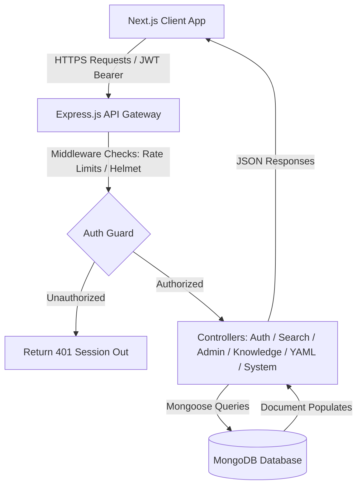
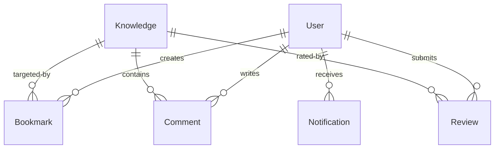
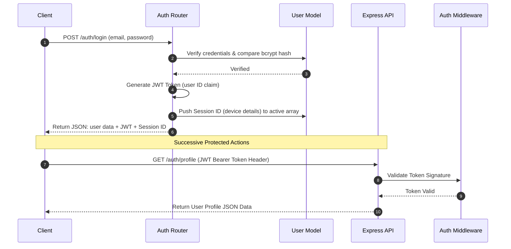

# DevOpsPulse: Enterprise DevOps & CI/CD Knowledge Platform
> A production-ready, premium dark-mode knowledge directory, pipeline simulator, YAML utility center, and developer discussion hub.

[](https://nextjs.org/)
[](https://react.dev/)
[](https://nodejs.org/)
[](https://expressjs.com/)
[](https://www.mongodb.com/)
[](https://tailwindcss.com/)
[](https://opensource.org/licenses/MIT)

---

## 📖 1. Project Overview

**DevOpsPulse** is a complete DevOps & CI/CD Knowledge Platform designed for modern software teams. It provides a structured, searchable catalog of production-ready configuration blueprints (Docker, Kubernetes, Terraform, Helm, GitHub Actions, GitLab CI, and Jenkins). 

### The Problem It Solves
Engineering teams waste valuable hours writing deployment configurations from scratch or copying untested snippets from public forums. In production settings, invalid YAML schemas, syntax issues, or misconfigured resource parameters lead to broken deployment cycles and security leaks. 

### Key Benefits
* **Verified Knowledge Base**: Centralizes production-grade, syntax-valid config blueprints.
* **Dry-Run Simulation**: Emulates build pipeline runs locally, streaming logs and tracking mock resource usages (CPU, Memory) before committing to production.
* **Advanced Relevance Engine**: Supports text search, categories, sorting, matching keyword highlights, and predictive auto-complete lookups.
* **MFA Security Integration**: Implements email confirmation, session tracking, remote session termination, and TOTP Multi-factor Authentication (MFA) via Google Authenticator.
* **Administrative Operations**: Grants admins controls to manage accounts, firewall bad IPs, compile template blueprints, and trigger database backup snapshots.

---

## 🌐 2. Live Demo Placeholders

* **Frontend Client Viewport**: `http://localhost:3000` (Local Dev Server) / `https://devopspulse.com` (Production target)
* **Backend API Gateway**: `http://localhost:5000/api/v1` (Local Express Server) / `https://api.devopspulse.com` (Production gateway)
* **Interactive OpenAPI Specs**: `http://localhost:5000/api-docs` (Swagger UI viewport)
* **Postman Collection Targets**: [postman_collection.json](file:///c:/Users/Admin/Desktop/cicd_epic/cicd_epic_jay_patel/postman_collection.json) / [postman_environment.json](file:///c:/Users/Admin/Desktop/cicd_epic/cicd_epic_jay_patel/postman_environment.json)

---

## ✨ 3. Platform Features

### 🔐 Authentication & Session Tracking
* **Secure JWT Sessions**: Signs tokens with expiry bounds (`24h`), validated inside HTTP request interceptors.
* **Remote Session Control**: Lists active session device models, logging IPs, and allowing remote session termination.
* **Google Authenticator TOTP**: Enables multi-factor authenticator app pairings with QR code generation.
* **Defensive Deletions**: Restricts account deletions behind warnings and re-authentications.

### 🔍 Search & Relevance Discovery
* **Full-Text Indexing**: Searches across instruction titles and YAML configurations using weighted compound text indices.
* **HTML Decoding**: Automatically decodes standard HTML character entity leaks inside views.
* **Dynamic Highlight Match**: Wraps search query words in custom styled `<mark>` elements.
* **Predictive Autocomplete**: Displays matching suggestion lists.
* **Metadata Filter Controls**: Filters results by tech tags, difficulty level, and views/likes popularity.

### ⚙️ Pipeline Dry-Run Simulation
* **Mock Log Stream**: Emulates build stages (Lint, Test, Compile, Release) inside an interactive console window.
* **Live Consumption Meters**: Simulates metric readouts (CPU, RAM, Network bandwidth) on active pipeline runs.

### 💬 Collaborative Forums & Ratings
* **Comment Feeds**: Standard CRUD thread feeds below guide details pages.
* **Reviews System**: Star ratings and text reviews updating the average likes of a guide.

### 🛡️ Administrative Controls
* **Account Elevating & Restricting**: Admin toggle role keys and account block/unblock options.
* **Snapshot Retaining**: Compiles and purges database backups.
* **Firewall Mappings**: Dynamic blocking of host IP ranges and recent audit logs tracking.
* **Guide Compiler**: Direct compiling of new blueprints via form inputs.

### 🛠️ YAML Utility Center
* **Syntax Parsing**: Checks files for formatting errors.
* **Structure Validation**: Validates key configurations for Kubernetes, Docker, and other standard systems.

---

## 🏗️ 4. System Architecture



### Request Lifecycle Flow
1. **Request Interception**: Axios client intercepts requests and inserts `Authorization: Bearer <token>`.
2. **Gateway Middleware**: Backend runs Helmet, CORS, and Express Rate Limit checks.
3. **Route Guards**: Route checks the `protect` validator verifying signature claims.
4. **Controller Actions**: Retrieves data from MongoDB or writes snapshot files.
5. **JSON Structs**: Returns standard wrappers `{ success: true, message: "...", data: [...] }`.

---

## 📂 5. Complete Frontend Folder Structure

```text
frontend/
├── app/                      # Next.js App Router Page directories
│   ├── admin/                # Administrative dashboards
│   │   └── page.tsx          # System accounts, firewalls, and backups layout
│   ├── bookmarks/            # Bookmarks layout page
│   ├── dashboard/            # Cloud cost and metrics dashboard
│   ├── knowledge/            # Guides details and runner simulator page
│   │   └── [id]/page.tsx     # Dynamic detailed blueprint view and console runner
│   ├── login/                # Session login page
│   ├── notifications/        # User inbox notifications alerts
│   ├── profile/              # User settings, password changes, browser sessions, 2FA
│   ├── register/             # User sign-up registration forms
│   ├── search/               # Advanced text search, sorting, and tag filters
│   ├── globals.css           # Global PostCSS styles
│   ├── layout.tsx            # Global HTML wrapper injecting providers
│   ├── middleware.ts         # Edge interceptor protecting private routes
│   └── page.tsx              # Home landing search and categories page
├── components/               # Shareable view layout components
│   ├── layout/               # Header, navbar navigation, footer panels
│   │   ├── footer.tsx
│   │   ├── navbar.tsx
│   │   └── sidebar.tsx
│   ├── shared/               # Code blocks, comments, reviews
│   │   ├── code-block.tsx
│   │   ├── comment-section.tsx
│   │   └── review-section.tsx
│   └── ui/                   # Reusable components (cards, skeleton loadings, toasters)
│       ├── card.tsx
│       ├── skeleton.tsx
│       └── toast.tsx
├── hooks/                    # TanStack Query custom hook definitions
│   ├── useAdmin.ts           # Admin accounts, IP blocks, and database snapshot mutations
│   ├── useAnalytics.ts       # Cloud summaries, usages, and top tools
│   ├── useAuth.ts            # Registrations, profile controls, browser sessions tracking
│   ├── useComments.ts        # Timeline comment CRUD mutations
│   ├── useKnowledge.ts       # Detail records, versions, logs, metrics, runs trigger
│   ├── useNotifications.ts   # Inbox alert markings and removals
│   ├── useReviews.ts         # User star ratings and reviews
│   └── useSearch.ts          # Autocomplete search, full-text queries
├── lib/                      # Core configurations
│   └── api.ts                # Custom Axios instance with interceptors
├── providers/                # React context wrapper managers
│   ├── authInitializer.tsx   # Fetches active user state from localStorage on mount
│   ├── queryProvider.tsx     # TanStack React Query Client wrapper
│   └── themeProvider.tsx     # Theme state controller adding dark/light tags to DOM
├── store/                    # Zustand persistent store files
│   ├── authStore.ts          # Persisted user tokens, profile detail updates
│   └── toastStore.ts         # Global toast alerts queue
├── types/                    # TypeScript data definitions
│   └── index.ts              # Custom type mapping interfaces (User, Knowledge, Comment)
└── package.json              # Client dependencies config
```

---

## 📂 6. Complete Backend Folder Structure

```text
backend/ (Root Project Folder)
├── scripts/                  # Seed configs and automated API tests
│   ├── resetAndSeed.js       # Resets MongoDB database and inserts fresh collections
│   ├── seedKnowledge.js      # Seeds catalog content and YAML blueprints
│   └── verify-api.js         # Basic API sanity tests
├── src/                      # API source code
│   ├── config/               # System setups
│   │   ├── db.js             # Mongoose connection pool client
│   │   └── config.js         # Port numbers, MongoDB URIs, JWT tokens
│   ├── constants/            # Constants definitions
│   │   └── system.js         # System configuration limits and constants
│   ├── controllers/          # Handles requests and executes service callbacks
│   │   ├── adminController.js # Users list, blocks, backups execution, firewall blocks
│   │   ├── analyticsController.js # Summary, costs, resource meters
│   │   ├── authController.js # Login, register, profile edits, bookmarks toggles
│   │   ├── knowledgeController.js # Workflow detail lookups, logs, comments
│   │   ├── systemController.js # System metrics and health indicators
│   │   ├── workflowController.js # Pipeline dry-run simulation triggers
│   │   └── yamlController.js # YAML file validations and syntax checking
│   ├── middleware/           # Pipeline routing controls
│   │   ├── adminMiddleware.js # Restricts routes to administrators
│   │   ├── authMiddleware.js # Protects routes, parsing JWT bearer claims
│   │   ├── errorMiddleware.js # Global Express exception handler
│   │   └── rateLimiters.js   # express-rate-limit middleware settings
│   ├── models/               # Mongoose schema configurations
│   │   ├── Analytics.js      # Metric logs schema
│   │   ├── Bookmark.js       # Unique user bookmarks schema
│   │   ├── Comment.js        # Timeline comments schema
│   │   ├── Knowledge.js      # Configuration instructions database schema
│   │   ├── Notification.js   # User alerts schema
│   │   ├── Review.js         # User ratings schema
│   │   └── User.js           # Password hashings, session subdocuments schema
│   ├── routes/               # API route mappings
│   │   ├── admin.routes.js   # Admin operations paths
│   │   ├── analytics.routes.js # Cost metrics pathways
│   │   ├── auth.routes.js    # Security credentials paths
│   │   ├── authRoutes.js     # Legacy security mappings
│   │   ├── comment.routes.js # User discussions routes
│   │   ├── debug.routes.js   # Debugging routes
│   │   ├── health.routes.js  # App uptime check
│   │   ├── index.js          # Main api/v1 route mounting gateway
│   │   ├── infra.routes.js   # Infrastructure settings routes
│   │   ├── knowledgeRoutes.js # Core catalog paths
│   │   ├── monitoring.routes.js # Audit and logs pathways
│   │   ├── notification.routes.js # Notifications routes
│   │   ├── review.routes.js  # star reviews pathways
│   │   ├── search.routes.js  # Advanced lookup endpoints
│   │   ├── system.routes.js  # Server diagnostics routes
│   │   ├── workflow.routes.js # Workflow execution endpoints
│   │   └── yaml.routes.js    # YAML parsing utilities route
│   ├── scripts/              # Internal utilities and verification scripts
│   │   ├── analyze-dataset.js # Validates MongoDB dataset constraints
│   │   ├── seed.js           # Seeds complete development values
│   │   ├── test-api.js       # Core API integration checks
│   │   └── test-bookmark.js  # Bookmark validation test scripts
│   ├── services/             # Direct database operations
│   │   ├── analyticsService.js # Cost metrics aggregations
│   │   ├── authService.js    # Registration hashes, MFA token pairings
│   │   ├── knowledgeService.js # Text searches, autocomplete prefix lookups, comments CRUD
│   │   ├── systemService.js  # OS checks and resource indicators
│   │   ├── workflowService.js # Builds simulation console strings and metrics
│   │   └── yamlService.js    # Standard syntax validator
│   ├── swagger/              # Swagger definitions
│   │   └── swagger.js        # Configures OpenAPI swagger document templates
│   ├── utils/                # Helper tools
│   │   ├── appError.js       # Custom operational exception model
│   │   ├── catchAsync.js     # Wraps async loops to catch errors
│   │   └── response.js       # Generates standard response JSON payloads
│   ├── validators/           # Express-validator schemas
│   │   ├── authValidator.js
│   │   ├── knowledgeValidator.js
│   │   ├── systemValidator.js
│   │   └── yamlValidator.js
│   └── app.js                # Mounts Express modules, routes, exception handlers
├── server.js                 # Listens to PORT connections
├── .env                      # Production/development environment configuration file
└── package.json              # Node dependencies configuration file
```

---

## 🗄️ 7. Database Design & Models

### A. Entity Relationship Mappings



### B. Schema Configurations

#### 1. Users (`User.js`)
* **Purpose**: Stores account authentication details, TOTP verification secrets, and logs current user device sessions.
* **Fields**:
  - `name` (String, required): Display name.
  - `email` (String, required, unique): Verified email key.
  - `password` (String, required): Hashed credentials block.
  - `role` (String, enum: `user` / `admin`): RBAC key.
  - `bookmarks` (Array of ObjectIds, ref: `Knowledge`): Redundant bookmark storage for populate queries.
  - `sessions` (Subdocument Array): Tracks `sessionId`, `device`, `ip`, and `lastActive` timestamp.
  - `twoFactorEnabled` (Boolean), `twoFactorSecret` (String): Multi-factor authentication values.

#### 2. Knowledge (`Knowledge.js`)
* **Purpose**: Core catalog repository database.
* **Fields**:
  - `instruction` (String, required): Description title of the blueprint.
  - `output` (String, required): Multi-line YAML configuration.
  - `topic` (String, required, indexed): Topic keyword (e.g. `kubernetes`).
  - `difficulty` (String, enum: `beginner`, `intermediate`, `advanced`, `expert`): Difficulty tag.
  - `views` (Number), `likes` (Number): Dynamic performance telemetry.

#### 3. Bookmarks (`Bookmark.js`)
* **Purpose**: Represents explicit guide bookmark relationships.
* **Fields**:
  - `user` (ObjectId, ref: `User`, required): Reader ID.
  - `knowledge` (ObjectId, ref: `Knowledge`, required): Target guide ID.
  - *Indexes*: Unique compound index on `{ user: 1, knowledge: 1 }` prevents duplicates.

---

## 🔌 8. API Documentation Summary

### A. Authentication APIs
| Method | Route | Description | Auth Required |
| :---: | :--- | :--- | :---: |
| **POST** | `/api/v1/auth/register` | Register a new developer account | No |
| **POST** | `/api/v1/auth/login` | Log in and start session tracking | No |
| **POST** | `/api/v1/auth/logout` | End active session | Yes |
| **GET** | `/api/v1/auth/profile` | Fetch user profile and populated bookmarks | Yes |
| **PATCH**| `/api/v1/auth/profile` | Update profile information | Yes |
| **DELETE**| `/api/v1/auth/profile` | Delete account | Yes |
| **POST** | `/api/v1/auth/change-password` | Update account password | Yes |
| **GET** | `/api/v1/auth/sessions` | List active browser sessions | Yes |
| **DELETE**| `/api/v1/auth/sessions/:id` | Terminate specific device session | Yes |
| **POST** | `/api/v1/auth/2fa/enable` | Enable TOTP 2FA | Yes |
| **POST** | `/api/v1/auth/2fa/disable` | Disable TOTP 2FA | Yes |

### B. Catalog & Run Simulator APIs
| Method | Route | Description | Auth Required |
| :---: | :--- | :--- | :---: |
| **GET** | `/api/v1/workflows` | Fetch paginated catalog guides | No |
| **GET** | `/api/v1/workflows/:id` | Retrieve guide blueprint details | No |
| **GET** | `/api/v1/workflows/trending` | Get popular guides by popularity | No |
| **GET** | `/api/v1/workflows/latest` | Get latest releases | No |
| **POST** | `/api/v1/workflows/:id/run` | Trigger dry-run pipeline simulation | Yes |
| **GET** | `/api/v1/workflows/:id/logs` | Fetch real-time simulated log streams | Yes |
| **GET** | `/api/v1/workflows/:id/metrics` | Fetch simulated pipeline telemetry metrics | Yes |
| **POST** | `/api/v1/workflows/:id/bookmark` | Toggle bookmark status for a guide | Yes |

### C. Search Engine APIs
| Method | Route | Description | Auth Required |
| :---: | :--- | :--- | :---: |
| **GET** | `/api/v1/search` | Execute full-text search query | No |
| **GET** | `/api/v1/search/tags` | Retrieve unique topic counts | No |
| **GET** | `/api/v1/search/autocomplete`| Fetch prefix suggestions lookup | No |

---

## 🔐 9. Authentication Flow



---

## 🔍 10. Search Engine Design

The advanced search engine operates with three lookup strategies:

1. **Full-Text Weighted Search**: Uses a compound MongoDB text index on the `instruction` and `output` fields of the `Knowledge` model. The `instruction` field is given double weight (`10`) compared to the `output` configuration code (`5`), prioritizing keyword matches in titles.
2. **Predictive Autocomplete Prefix Search**: Evaluates case-insensitive query prefixes. Matches are returned instantly inside debounced input dropdowns:
   ```javascript
   instruction: { $regex: `^${q}`, $options: 'i' }
   ```
3. **Relevance Filtering & Highlight Swaps**:
   - Compiles unique tags list dynamically using database aggregations.
   - Cleans HTML entities and applies matching keyword highlighting via frontend `<mark>` element injections.

---

## 🛠️ 11. Installation Guide

### Prerequisites
* **Node.js**: Ensure Node.js (version 18.x or above recommended) is installed on your workstation.
* **MongoDB**: Ensure a local MongoDB instance is running on port `27017` or use a MongoDB Atlas URI string.

### Setup Instructions

#### 1. Setup Backend API Gateway
Clone the repository and install all Node packages inside the root folder:
```bash
# Install server modules
npm install

# Setup environment variables
# Duplicate default config if needed and verify .env exists in the root:
# PORT=5000
# MONGO_URI=mongodb://127.0.0.1:27017/devops_knowledge
# JWT_SECRET=devops_knowledge_platform_secret_jwt_key_2026
# JWT_EXPIRE=24h

# Reset database and seed with mock records (topic tags, configurations)
npm run seed:reset

# Start Nodemon backend developer server
npm run dev
```

#### 2. Setup Frontend Application
Navigate into the frontend page directory, configure connection keys, and start the Next.js dev server:
```bash
# Navigate to frontend folder
cd frontend

# Install client packages
npm install

# Verify client .env.local file exists with:
# NEXT_PUBLIC_API_URL=http://localhost:5000/api/v1

# Start Turbopack compiler development server
npm run dev
```
Open your browser and navigate to `http://localhost:3000` to interact with the platform.

---

## ⚙️ 12. Environment Variables Mappings

### A. Backend Variables (`.env`)
| Key Name | Default Value | Description |
| :--- | :--- | :--- |
| `PORT` | `5000` | Local port backend server listens to. |
| `MONGO_URI` | `mongodb://127.0.0.1:27017/devops_knowledge` | Connection string target for MongoDB. |
| `JWT_SECRET` | `devops_knowledge_platform_secret_jwt_key_2026` | Token generation encryption seed. |
| `JWT_EXPIRE` | `24h` | Access token lifespan before refresh requirement. |
| `NODE_ENV` | `development` | Target runtime configuration environment. |

### B. Frontend Variables (`frontend/.env.local`)
| Key Name | Default Value | Description |
| :--- | :--- | :--- |
| `NEXT_PUBLIC_API_URL` | `http://localhost:5000/api/v1` | URL routing client Axios actions. |

---

## 🧪 13. Testing & Verification Suites

### A. Automated Integration Testing
To run the automated endpoint validation suite, launch the backend and execute the verification scripts:
```bash
# Runs health endpoints, login tests, and full text searches
node src/scripts/test-api.js

# Verifies bookmark toggles, add mutations, and bad parameter handlers
node src/scripts/test-bookmark.js
```

### B. Postman Collections Verification
Import the collection mapping files inside your local workspace:
* **Collections Collection**: `postman_collection.json`
* **Environments variables**: `postman_environment.json`

---

## 🛡️ 14. Security Hardening Features

* **Helmets & CORS**: Configures HTTP headers (`helmet`) and permits local communication origins.
* **Rate Limiting**: Restricts brute-force authentication attacks by capping requests per IP.
* **XSS & Validation Protection**: Sanitizes payloads utilizing `express-validator` and `zod` on input borders.
* **Authentication Guards**: Resolves signature claims, blocking requests from unauthorized origins.

---

## ⚠️ 15. Challenges Faced

1. **Hydration Mismatches**: Theme toggles caused Next.js to trigger DOM mismatch warnings. Resolved by implementing the **Mounted State Pattern** inside navigation headers.
2. **Rules of Hooks Closure Bounds**: Placing query hook initializations inside parent wrappers violated hooks sequence rules. Refactored the hook queries to be top-level exports.
3. **Relational Database Updates**: Keeping average likes synced with review additions was resolved by adding asynchronous pre-save calculations in the reviews schema.

---

## 🚀 16. Future Roadmap

- [ ] **Threaded Comments**: Add replies nesting structures.
- [ ] **Social Sign-Ins**: Integrate GitHub and Google OAuth.
- [ ] **Configuration Converters**: Add direct converter tabs to translate YAML files to JSON or vice versa.
- [ ] **Web Terminal Executions**: Connect to real sandboxed runners via Kubernetes API.

---

## 👤 17. Author

* **Jay Patel** - *Lead Engineer / DevOps Architect*
* Github Profile: [@Jay-Patel-cg](https://github.com/Jay-Patel-cg)
* Project Repo: [cicd_epic_jay_patel](https://github.com/Jay-Patel-cg/cicd_epic_jay_patel)

---

## 📄 18. License

This project is licensed under the MIT License - see the [LICENSE](LICENSE) file for details.